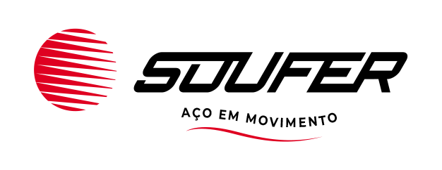

<div align="center">



### Controle web de retirada e devolução de ferramentas

[](web/README.md)
[](api/README.md)
[](docs/banco-de-dados/banco.md)
[](api/README.md)
[](https://www.figma.com/design/jARhREffx0KXWn1UTUpxmE/SOUFER-Tools?node-id=0-1&t=61MfK99T9QNMeL7p-1)

</div>

---

Sistema web de controle de retirada e devolução de ferramentas da
manutenção da **Soufer**, desenvolvido como Projeto Integrado 2026.2
("Desenvolvimento de Soluções Web Inteligentes e Integradas").

Substitui o controle manual em planilha/papel por um fluxo digital com
leitura de código de barras (Code128), histórico de empréstimos, registro
automático de ocorrências (avaria/perda) e consulta pública de
disponibilidade — alinhado ao ODS 9 (Indústria, Inovação e Infraestrutura),
com ODS 12 (Consumo e Produção Responsáveis) como secundário.

## Equipe

| Nome | RA | Papel |
|------|-----|-------|
| Guilherme Portilho da Rosa Santi | 25000151 | Back-end + Infra |
| Henrique de Oliveira Molinari | 25001176 | Back-end |
| João Augusto de Freitas | 25000019 | Front-end (líder/facilitador) |
| Kauan Leander Leandrini | 25000795 | Front básico + Apresentação |

## Stack

| Camada | Tecnologias |
|---|---|
| **Front (`/web`)** | Vite, React 19, React Router 7, TanStack Query, Axios, React Hook Form + Zod, Tailwind v4, shadcn/ui, Recharts, `react-barcode` |
| **Back (`/api`)** | Node 20, TypeScript, Express, `pg` (PostgreSQL nativo, sem ORM), `bcryptjs` + `jsonwebtoken`, Zod, Helmet, Pino, Swagger UI |
| **Banco** | PostgreSQL dedicado (migrations versionadas em `api/db/migrations/`) |
| **Nuvem** | AWS EC2 (API via PM2 + Nginx) + S3/CloudFront (front) + CloudWatch — plano B: Servidor Próprio |

## Estrutura do repositório

```text
PI-2026.2/
├── api/           # API REST (Node + TypeScript + Express + PostgreSQL) — ver api/README.md
├── web/           # Front-end (Vite + React) — ver web/README.md e web/CLAUDE.md
├── docs/          # Documentação técnica e de projeto (índice completo abaixo)
├── CLAUDE.md      # Regras de negócio, cronograma e convenções do projeto
└── CONTRIBUTING.md # Fluxo de branches, commits e Pull Requests
```

## Instalação e uso

Pré-requisitos: Node.js 20+ e uma instância PostgreSQL acessível.

### 1. API (`/api`)

```bash
cd api
cp .env.example .env      # ajuste DB_HOST/DB_USER/DB_PASSWORD/JWT_SECRET
npm install
npm run db:migrate        # cria o schema
npm run db:seed           # dados iniciais (opcional)
npm run dev                # http://localhost:3000, docs em /docs (Swagger)
```

Detalhes de arquitetura, endpoints e estrutura de pastas: [api/README.md](api/README.md).

### 2. Front-end (`/web`)

```bash
cd web
cp .env.example .env      # VITE_API_URL=http://localhost:3000/v1
npm install
npm run dev                 # http://localhost:5173
```

Sem a API rodando, o botão **"Entrar sem a API (demonstração)"** na tela de
login abre o sistema com dados simulados — útil para avaliar só a interface.

Convenções de código, estrutura de pastas e decisões do front: [web/CLAUDE.md](web/CLAUDE.md).

## Design system

O protótipo navegável original está no [Figma](https://www.figma.com/design/jARhREffx0KXWn1UTUpxmE/SOUFER-Tools?node-id=0-1&t=61MfK99T9QNMeL7p-1),
mas os tokens do design system em si não vivem mais lá — foram fechados
direto em código (`web/src/index.css`, tokens em `@theme inline`) e
documentados ao vivo em `/design-system` dentro da aplicação
(`web/src/pages/DesignSystemPage.tsx`), que é a fonte de verdade atual.

<div align="center">


&nbsp;|&nbsp;


</div>

- **Cor:** vermelho de marca `#E30613` (ação primária), `#B5121B`
  (hover/pressed), texto `#1D1D1B`. Cores de status (disponível/em
  uso/indisponível/atraso) são exclusivas de badge e indicador — nunca usadas
  em botão ou área de marca. Status nunca depende só de cor: cada estado tem
  forma própria (`StatusBadge`, círculo cheio/vazado/quadrado/triângulo) —
  os badges acima são só ilustrativos, na aplicação real cada um também tem
  seu ícone.
- **Tipografia:** Geist Variable, escala própria (`text-display`,
  `text-titulo`, `text-secao`/`text-corpo`, `text-rotulo`, `text-kpi`); texto
  corrido nunca abaixo de 14px.
- **Controles:** altura mínima de 56–60px nas ações principais, pensada para
  uso com luva no chão de fábrica.
- **Movimento:** só `transform`/`opacity` (regra de 60fps, verificada por
  `npm run check:motion`), durações e easing únicos (`--motion-*`,
  `--ease-soufer`), com `prefers-reduced-motion` tratado globalmente.
- **Responsividade:** toda tela validada em 360px, 768px e 1280px antes de
  ser considerada concluída.

## Documentação

Índice completo em `/docs`:

### Orientações
- [Orientação oficial do PI 2026-2](<docs/orientacoes/Orientação PI 2026-2 -DESENVOLVIMENTO DE APLICAÇÃO WEB.pdf>)
- [Relatório da visita técnica à manutenção](docs/orientacoes/VisitaTecnica.pdf)
- [Equipe e responsabilidades](docs/orientacoes/equipe.md)
- [Milestones, padrões e checklist](docs/orientacoes/projeto.md)

### Entregas PI
- **Integração de Dados — Max Vallim:** [Entrega 05/09](docs/entregas-pi/integracao-de-dados-max-vallim/entrega-max-05-09-2026.pdf)
- **Tecnologias para Desenvolvimento Web — Nivaldo Andrade:** [Entrega 05/09](docs/entregas-pi/tecnologias-desenvolvimento-web-nivaldo-andrade/entrega-nivaldo-05-09-2026.pdf)
- **Computação em Nuvem — Rodrigo Marudi:** _(entregas ainda não versionadas nesta pasta)_
- **Desenvolvimento de Interfaces de Usuário para Web — Marcelo Ciacco:** [Entrega P1 (02/10)](docs/entregas-pi/desenvolvimento-interfaces-marcelo-ciacco/soufer-tools-frontend-p1-02-10-2026.pdf)

### Frontend
- [Rotas, componentes e interface](docs/frontend/front.md)

### Backend
- [Arquitetura geral](docs/backend/arquitetura.md)
- [Endpoints e convenções da API](docs/backend/api.md)
- [Regras de negócio e fluxos](docs/backend/processos.md)
- [Exemplo de retorno da BrasilAPI](docs/backend/exemplos/brasilapi-feriados-2026.json)

### Banco de Dados
- [Modelagem e regras do banco](docs/banco-de-dados/banco.md)
- [Dicionário de dados](docs/banco-de-dados/dicionario-de-dados.md)
- [Documentação do DER](docs/banco-de-dados/der-documentacao.md)
- [Integração, importação e qualidade de dados](docs/banco-de-dados/dados.md)
- [Fluxo de integração de dados externos](docs/banco-de-dados/fluxo-integracao.md)

### Nuvem
- [Infraestrutura, deploy e custos](docs/nuvem/infraestrutura.md)
- [Guia de deploy no Dokploy](docs/nuvem/dokploy.md)
- [Plano de infraestrutura e modelos em nuvem (M2)](docs/nuvem/infra-plano.md)
- [Comparativo de custos AWS/Azure/GCP](docs/nuvem/custos-nuvem.md)
- [Nomenclatura e comparação de serviços entre provedores](docs/nuvem/nomenclatura-provedores.md)

## Roadmap (próximas entregas)

O cronograma detalhado (sprints, issues, dependências, responsáveis e status)
não vive neste README — fica desatualizado rápido demais. Fonte de verdade:

- [Issues](https://github.com/joaoaugusto-dev/PI-2026.2/issues)
- [Milestones](https://github.com/joaoaugusto-dev/PI-2026.2/milestones)

Em aberto, em ordem: integração real front↔API (substituindo os dados
mockados do front por consumo da API REST), troca do contrato de auth de
e-mail para matrícula (issue #150), decisão final sobre etiqueta física do
código de patrimônio (issue DB-01), autenticação/segurança de produção e
deploy em nuvem (AWS EC2 + S3/CloudFront).

## Contribuindo

Antes de abrir um Pull Request, leia o [guia de contribuição](CONTRIBUTING.md),
que define as convenções de branches, commits e o fluxo de revisão do
projeto.
