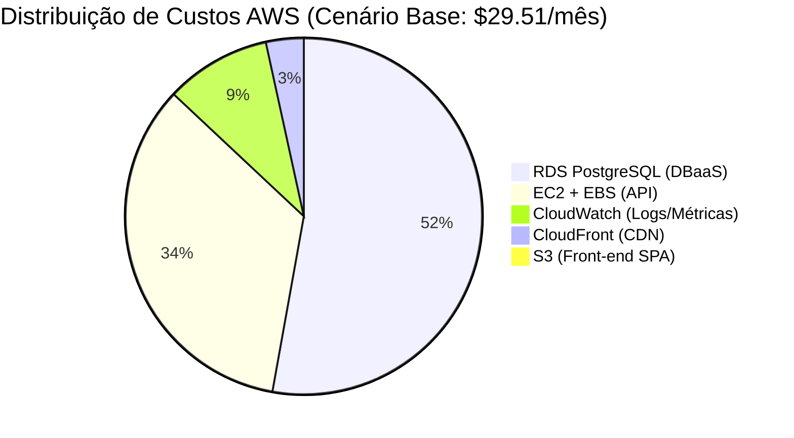
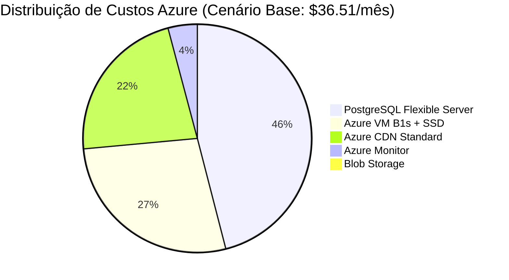
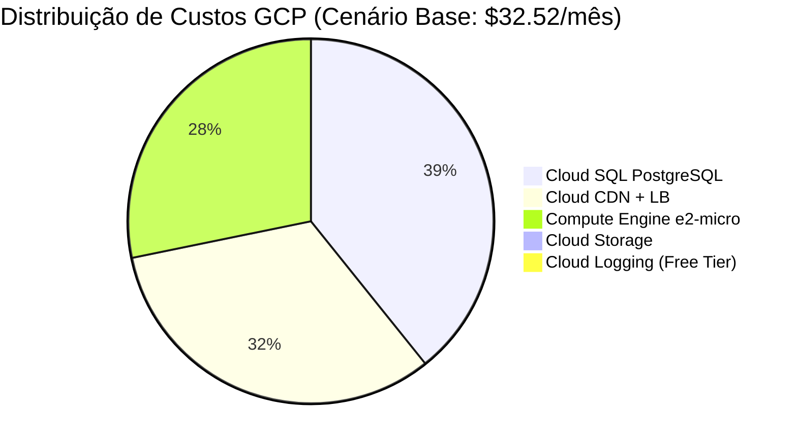

# Comparativo de Custos em Nuvem: AWS vs Azure vs GCP

**Projeto:** Soufer Tools  
**Documento de Referência:** INFRA-02  
**Depende de:** [INFRA-01: Plano de Infraestrutura e Modelos de Serviço](infra-plano.md)  
**Planilha Oficial:** [`custos-nuvem.xlsx`](custos-nuvem.xlsx)  
**Prints das Simulações:** [`prints/`](prints/)  
**Cotação de Referência:** USD 1.00 = R$ 5,50  

---

## 1. Sumário Executivo

Este documento consolida a simulação e o comparativo financeiro de infraestrutura em nuvem para a solução **Soufer Tools**, avaliando os três maiores provedores de mercado: **Amazon Web Services (AWS)**, **Microsoft Azure** e **Google Cloud Platform (GCP)**.

Foram modelados **três cenários estratégicos**:
1. **Cenário 1 (Recomendado / Base):** Arquitetura com Banco de Dados Relacional Gerenciado (**PaaS / DBaaS**) para máxima confiabilidade, integridade ACID e backups automáticos.
2. **Cenário 2 (Econômico / Self-Hosted):** PostgreSQL instalado diretamente na máquina virtual da API (**IaaS**), reduzindo custos de licença e serviço gerenciado para fases de desenvolvimento ou PoC.
3. **Cenário 3 (Alta Disponibilidade / Plano B):** Arquitetura Base + 2ª Instância em **Standby** para failover contínuo e tolerância a falhas.

### Tabela Resumo Consolidada

| Cenário de Infraestrutura | AWS (USD) | AWS (BRL) | Azure (USD) | Azure (BRL) | GCP (USD) | GCP (BRL) | Provedor Mais Econômico |
|---|---|---|---|---|---|---|---|
| **Cenário 1: Base (DBaaS Gerenciado)** | **$29.51** | **R$ 162,31** | $36.51 | R$ 200,81 | $32.52 | R$ 178,86 | **AWS** ($29.51/mês) |
| **Cenário 2: Econômico (Self-Hosted)** | **$14.07** | **R$ 77,39** | $19.83 | R$ 109,07 | $19.85 | R$ 109,18 | **AWS** ($14.07/mês) |
| **Cenário 3: Alta Disp. (Standby)** | **$39.50** | **R$ 217,25** | $46.50 | R$ 255,75 | $41.63 | R$ 228,97 | **AWS** ($39.50/mês) |
| **Total Anual Estimado (Cenário 1)** | **$354.12** | **R$ 1.947,66** | $438.12 | R$ 2.409,66 | $390.24 | R$ 2.146,32 | **AWS** (-19.2% vs Azure) |

> [!TIP]
> **Veredito Financeiro:** A **AWS** apresentou o menor custo total mensal no Cenário Base ($29.51/mês), impulsionada principalmente pela camada de **Always Free Tier do CloudFront** (1 TB de transferência de dados e 10 milhões de requisições mensais inclusas).

---

## 2. Dimensionamento dos Componentes por Provedor

A arquitetura foi rigorosamente equiparada entre os provedores para garantir paridade técnica:

| Componente | Parâmetros Técnicos | AWS | Microsoft Azure | Google Cloud (GCP) |
|---|---|---|---|---|
| **API / Back-end** | 1-2 vCPUs (burst), 1 GiB RAM, 30-32 GB SSD, Linux Ubuntu, 730h/mês | **Amazon EC2** `t3.micro` + EBS gp3 (30 GB) | **Azure VM** `B1s` + Managed SSD (32 GB) | **Compute Engine** `e2-micro` + Balanced PD (30 GB) |
| **Front-end SPA** | 10 GB Storage Standard, 50k leituras (GET), 5k gravações (PUT) | **Amazon S3** Standard | **Azure Blob Storage** Hot LRS | **Cloud Storage** Standard |
| **CDN & Distribuição** | 100 GB Data Out, SSL gratuito gerenciado, 1M req HTTPS | **Amazon CloudFront** | **Azure CDN Standard** / Front Door | **Cloud CDN** + External HTTP(S) LB |
| **Banco de Dados (DBaaS)** | PostgreSQL 16+, 1-2 vCPUs, 1-2 GiB RAM, 20-32 GB SSD, Backups diários | **Amazon RDS** `db.t3.micro` (20 GB gp3) | **Azure PostgreSQL Flexible** `B1ms` (32 GB) | **Cloud SQL PostgreSQL** `db-f1-micro` (20 GB SSD) |
| **Monitoramento / Logs** | 5 GB ingestão de logs/mês, telemetria de CPU/RAM, 3 alarmes | **Amazon CloudWatch** | **Azure Monitor** (Log Analytics) | **Cloud Logging & Monitoring** |
| **Standby (Plano B)** | 2ª Instância de API dedicada para failover | +1 EC2 `t3.micro` (30GB) | +1 Azure VM `B1s` (32GB) | +1 GCE `e2-micro` (30GB) |

---

## 3. Composição Detalhada Linha a Linha

### 3.1 Amazon Web Services (AWS)

*Região Base: `us-east-1` (N. Virginia)*  
*Calculadora Oficial: [calculator.aws](https://calculator.aws/)*

| ID | Item / Componente | Serviço AWS | Configuração / Dimensionamento | Custo USD | Custo BRL |
|---|---|---|---|---|---|
| AWS-01 | API Back-end Compute | Amazon EC2 | `t3.micro` (2 vCPU, 1 GB RAM, Linux) - 730h | $7.59 | R$ 41,75 |
| AWS-02 | API Sistema Operacional | Amazon EBS (gp3) | 30 GB SSD gp3 (3.000 IOPS, 125 MB/s) | $2.40 | R$ 13,20 |
| AWS-03 | Front-end SPA Storage | Amazon S3 Standard | 10 GB de armazenamento estático | $0.23 | R$ 1,27 |
| AWS-04 | Front-end Requisições | Amazon S3 Ops | 50.000 GET + 5.000 PUT | $0.05 | R$ 0,28 |
| AWS-05 | CDN Tráfego de Saída | Amazon CloudFront | 100 GB Data Out (Always Free Tier) | $0.00 | R$ 0,00 |
| AWS-06 | CDN Requisições HTTPS | Amazon CloudFront Ops | 1.000.000 requisições HTTPS | $1.00 | R$ 5,50 |
| AWS-07 | Banco PostgreSQL Compute | Amazon RDS PostgreSQL | `db.t3.micro` (Single-AZ, 1 GB RAM) - 730h | $13.14 | R$ 72,27 |
| AWS-08 | Banco PostgreSQL Storage | Amazon RDS Storage (gp3) | 20 GB SSD gp3 + Backups inclusos | $2.30 | R$ 12,65 |
| AWS-09 | Telemetria & Logs | Amazon CloudWatch | 5 GB Log Ingestion + 3 Alarmes | $2.80 | R$ 15,40 |
| **TOTAL** | **Cenário Base (DBaaS)** | — | **Soma dos itens AWS-01 a AWS-09** | **$29.51** | **R$ 162,31** |
| *AWS-10* | *Plano B: Standby EC2* | *Amazon EC2 + EBS* | *+1 EC2 t3.micro + 30GB gp3* | *+$9.99* | *+R$ 54,95* |
| *AWS-11* | *Self-Hosted na EC2* | *PostgreSQL Local* | *Substitui RDS por banco na própria EC2* | *-$15.44* | *-R$ 84,92* |

---

### 3.2 Microsoft Azure

*Região Base: `East US` (Virginia)*  
*Calculadora Oficial: [azure.microsoft.com/pricing/calculator](https://azure.microsoft.com/en-us/pricing/calculator/)*

| ID | Item / Componente | Serviço Azure | Configuração / Dimensionamento | Custo USD | Custo BRL |
|---|---|---|---|---|---|
| AZ-01 | API Back-end Compute | Azure Virtual Machines | `B1s` (1 vCPU, 1 GB RAM, Linux) - 730h | $7.59 | R$ 41,75 |
| AZ-02 | API Disco de Sistema | Azure Managed Disks | 32 GB Standard SSD (E4 tier) | $2.40 | R$ 13,20 |
| AZ-03 | Front-end SPA Storage | Azure Blob Storage | 10 GB Standard Hot LRS | $0.18 | R$ 0,99 |
| AZ-04 | Front-end Transações | Azure Storage Ops | 50.000 Leituras + 5.000 Gravações | $0.06 | R$ 0,33 |
| AZ-05 | CDN Tráfego de Saída | Azure CDN Standard | 100 GB Data Out ($0.081/GB) | $8.10 | R$ 44,55 |
| AZ-06 | CDN Perfil & Certificado | Azure CDN Profile | SSL Gerenciado Gratuito incluso | $0.00 | R$ 0,00 |
| AZ-07 | Banco PostgreSQL Compute | Azure PostgreSQL Flexible | Burstable `B1ms` (1 vCPU, 2 GB RAM) - 730h | $13.00 | R$ 71,50 |
| AZ-08 | Banco PostgreSQL Storage | Azure DB Storage | 32 GB Standard Storage + Backups inclusos | $3.68 | R$ 20,24 |
| AZ-09 | Telemetria & Logs | Azure Monitor | 5 GB Log Ingestion + Métricas | $1.50 | R$ 8,25 |
| **TOTAL** | **Cenário Base (DBaaS)** | — | **Soma dos itens AZ-01 a AZ-09** | **$36.51** | **R$ 200,81** |
| *AZ-10* | *Plano B: Standby VM* | *Azure VM B1s + SSD* | *+1 VM B1s + 32GB SSD* | *+$9.99* | *+R$ 54,95* |
| *AZ-11* | *Self-Hosted na VM* | *PostgreSQL Local* | *Substitui Flexible Server por banco local* | *-$16.68* | *-R$ 91,74* |

---

### 3.3 Google Cloud Platform (GCP)

*Região Base: `us-central1` (Iowa)*  
*Calculadora Oficial: [cloud.google.com/products/calculator](https://cloud.google.com/products/calculator)*

| ID | Item / Componente | Serviço GCP | Configuração / Dimensionamento | Custo USD | Custo BRL |
|---|---|---|---|---|---|
| GCP-01 | API Back-end Compute | Compute Engine | `e2-micro` (2 vCPU burst, 1 GB RAM) - 730h | $6.11 | R$ 33,61 |
| GCP-02 | API Disco de Sistema | Balanced Persistent Disk | 30 GB Balanced PD Storage | $3.00 | R$ 16,50 |
| GCP-03 | Front-end SPA Storage | Cloud Storage Standard | 10 GB Standard Storage Class | $0.20 | R$ 1,10 |
| GCP-04 | Front-end Operações | Cloud Storage Ops | 50.000 Classe B + 5.000 Classe A | $0.04 | R$ 0,22 |
| GCP-05 | CDN Cache Egress | Cloud CDN | 100 GB Cache Egress ($0.08/GB) | $8.00 | R$ 44,00 |
| GCP-06 | Load Balancer Frontend | External HTTP(S) LB | Forwarding Rules + SSL Gerenciado | $2.50 | R$ 13,75 |
| GCP-07 | Banco PostgreSQL Compute | Cloud SQL for PostgreSQL | `db-f1-micro` (Shared Core vCPU) - 730h | $7.67 | R$ 42,19 |
| GCP-08 | Banco PostgreSQL Storage | Cloud SQL SSD Storage | 20 GB SSD ($3.40) + 20 GB Backups ($1.60) | $5.00 | R$ 27,50 |
| GCP-09 | Telemetria & Logs | Cloud Logging & Monitoring | Até 50 GiB/mês inclusos no Always Free | $0.00 | R$ 0,00 |
| **TOTAL** | **Cenário Base (DBaaS)** | — | **Soma dos itens GCP-01 a GCP-09** | **$32.52** | **R$ 178,86** |
| *GCP-10* | *Plano B: Standby GCE* | *Compute Engine + PD* | *+1 GCE e2-micro + 30GB PD* | *+$9.11* | *+R$ 50,11* |
| *GCP-11* | *Self-Hosted no GCE* | *PostgreSQL Local* | *Substitui Cloud SQL por banco local* | *-$12.67* | *-R$ 69,69* |

---

## 4. Análise Comparativa dos Cenários

```mermaid
xychart-beta
    title "Comparativo Mensal por Provedor e Cenário (USD)"
    x-axis ["AWS", "Azure", "GCP"]
    y-axis "Custo Mensal (USD)" 0 --> 50
    bar [29.51, 36.51, 32.52]
    bar [14.07, 19.83, 19.85]
    bar [39.50, 46.50, 41.63]
```

*(Legenda das barras: Barra 1 = Cenário 1 Base / Barra 2 = Cenário 2 Econômico / Barra 3 = Cenário 3 Standby)*

### 4.1 Cenário 1: Base (Banco Gerenciado DBaaS) — Recomendado
- **Custo Médio:** $32.85 / mês (R$ 180,66 / mês).
- **Racional:** Elimina overhead de manutenção do SO, patches de segurança e scripts manuais de backup. É a arquitetura que atende plenamente aos requisitos de integridade ACID, views, índices parciais e triggers do Soufer Tools.

### 4.2 Cenário 2: Econômico (PostgreSQL Self-Hosted na VM)
- **Economia Média:** Redução de **52.3%** na AWS ($14.07/mês vs $29.51/mês).
- **Trade-off:** Exige configuração manual de `pg_dump` para cron jobs, retenção de backups, monitoramento de espaço em disco e riscos de contenção de CPU/RAM entre a API Node.js e o PostgreSQL.
- **Recomendação:** Indicado para ambientes de desenvolvimento, homologação ou PoC inicial.

### 4.3 Cenário 3: Alta Disponibilidade (Plano B com Standby Instance)
- **Custo Adicional:** Entre **+$9.11** (GCP) e **+$9.99** (AWS/Azure) mensais.
- **Benefício:** Instância secundária pré-provisionada pronta para assumir o tráfego via chaveamento de DNS ou Load Balancer em caso de indisponibilidade da instância primária.
- **Alternativa PaaS:** Conforme previsto no [infra-plano.md](infra-plano.md), a adoção de plataformas PaaS como **Render** ou **Railway** permite failover instantâneo sob demanda com custo zero em standby (cold standby).

---

## 5. Estrutura da Planilha `docs/entregas-pi/computacao-em-nuvem-rodrigo-marudi/custos-nuvem.xlsx`

A planilha oficial foi gerada com formatação corporativa, fórmulas dinâmicas e imagens integradas:

1. **Aba `Resumo Comparativo`:**
   - Dashboard executivo com cartões de KPI (Menor Custo, Média, Cotação).
   - Tabela consolidada com fórmulas vinculadas entre as abas (`='AWS - Detalhamento'!G...`).
   - Conversão monetária em tempo real baseada na célula `B5` (Cotação USD/BRL).
   - Matriz de trade-offs técnicos.
2. **Aba `AWS - Detalhamento`:**
   - Detalhamento linha a linha dos 9 componentes base + 2 cenários adicionais.
3. **Aba `Azure - Detalhamento`:**
   - Detalhamento linha a linha dos serviços Azure equivalentes.
4. **Aba `GCP - Detalhamento`:**
   - Detalhamento linha a linha dos serviços Google Cloud equivalentes.
5. **Aba `Prints & Evidencias`:**
   - Imagens em alta resolução dos comprovantes e demonstrativos das simulações anexadas diretamente na pasta de trabalho.

---

## 6. Evidências Visuais das Simulações

Os demonstrativos visuais gerados a partir dos cálculos oficiais encontram-se arquivados em [`prints/`](prints/):

1. **Dashboard Consolidado:** `docs/entregas-pi/computacao-em-nuvem-rodrigo-marudi/prints/comparativo_custos_resumo.png`
2. **Simulação AWS:** `docs/entregas-pi/computacao-em-nuvem-rodrigo-marudi/prints/aws_calculator_estimate.png`
3. **Simulação Azure:** `docs/entregas-pi/computacao-em-nuvem-rodrigo-marudi/prints/azure_calculator_estimate.png`
4. **Simulação GCP:** `docs/entregas-pi/computacao-em-nuvem-rodrigo-marudi/prints/gcp_calculator_estimate.png`

