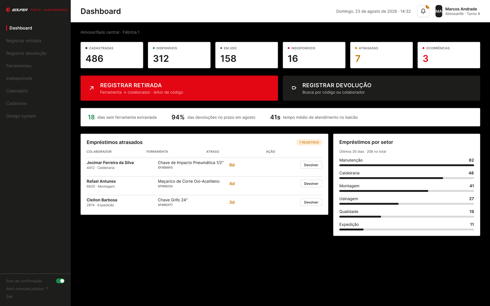
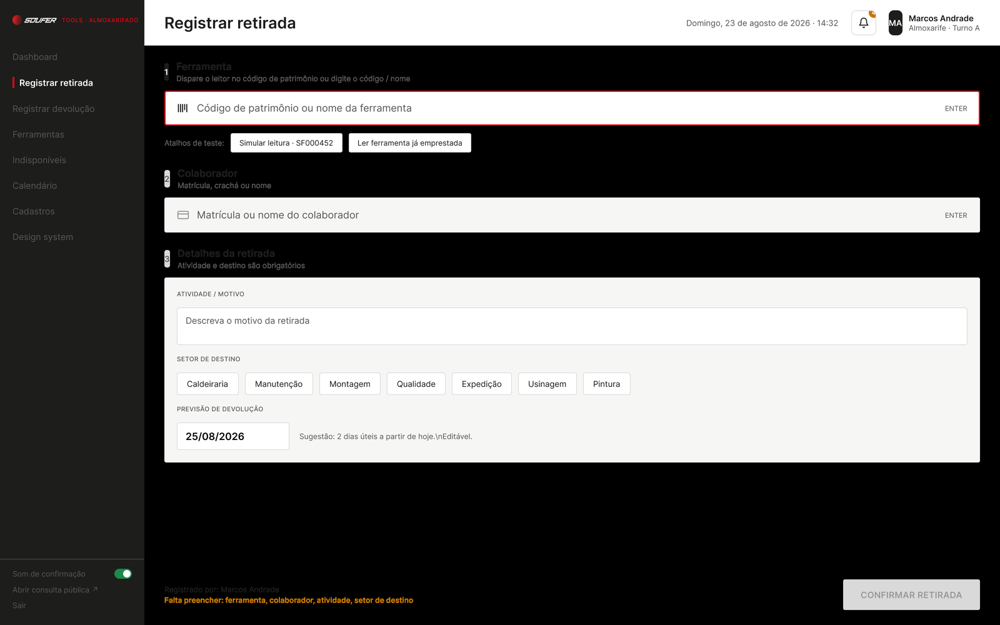
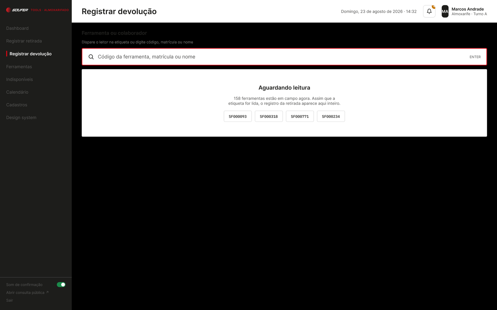
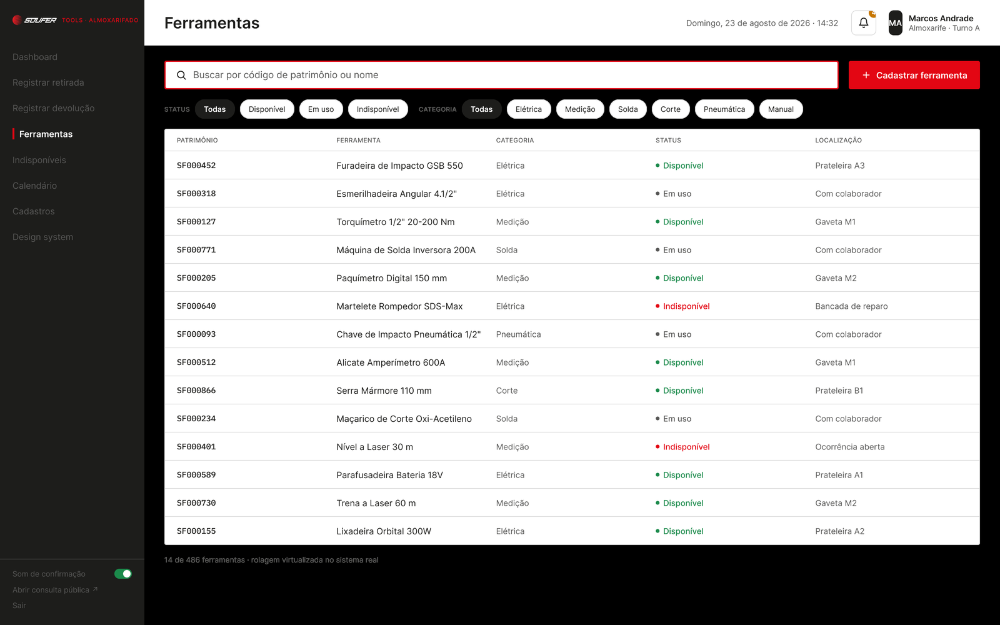
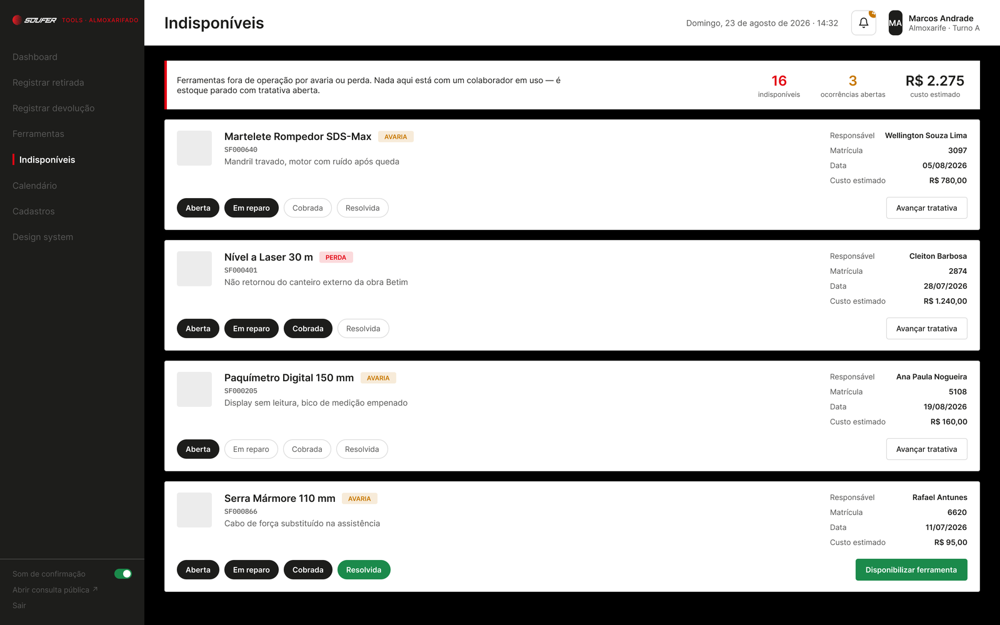
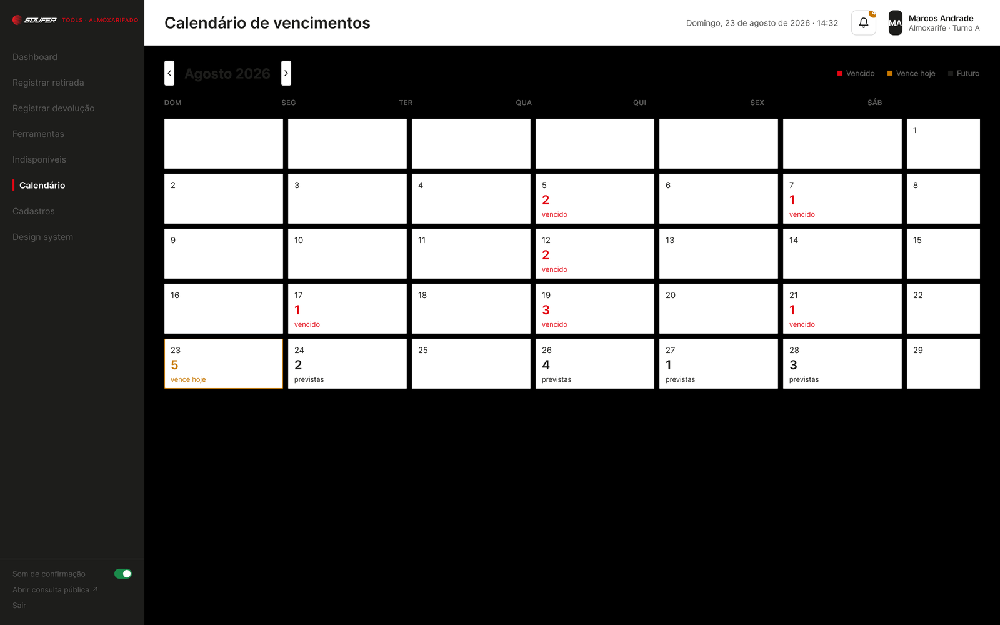
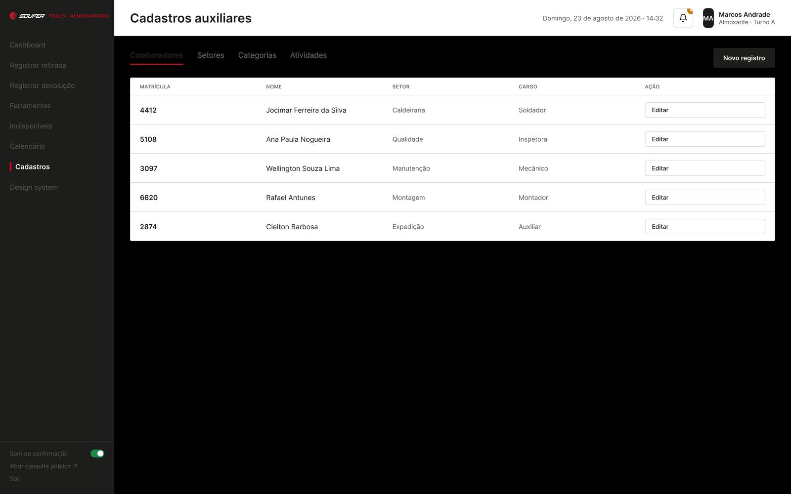
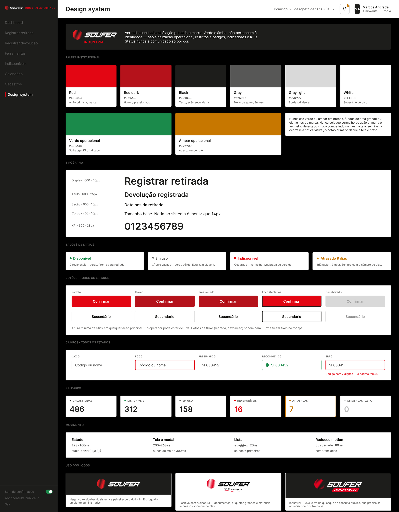

# Protótipo — Sistema de Almoxarifado

Documentação visual do protótipo de alta fidelidade desenhado no Figma para o
controle de empréstimo e devolução de ferramentas do almoxarifado central.

Todas as capturas foram exportadas do protótipo navegável e refletem o estado
aprovado do design. Quando uma tela mudar no Figma, substitua o arquivo
correspondente em `assets/` mantendo o mesmo nome — os links continuam válidos.

## Índice

1. [Dashboard](#1--dashboard)
2. [Registrar retirada](#2--registrar-retirada)
3. [Registrar devolução](#3--registrar-devolução)
4. [Ferramentas](#4--ferramentas)
5. [Indisponíveis](#5--indisponíveis)
6. [Calendário de vencimentos](#6--calendário-de-vencimentos)
7. [Cadastros auxiliares](#7--cadastros-auxiliares)
8. [Design system](#8--design-system)

## Estrutura de navegação

```
Login
└── Sistema (sidebar fixa)
    ├── Dashboard ......... entrada padrão do almoxarife
    │   ├── Registrar retirada     (atalho primário)
    │   └── Registrar devolução    (atalho secundário)
    ├── Registrar retirada
    ├── Registrar devolução
    ├── Ferramentas ....... busca, filtros e cadastro
    ├── Indisponíveis ..... fila de ocorrências
    ├── Calendário ........ vencimentos do mês
    ├── Cadastros ......... colaboradores · setores · categorias · atividades
    └── Design system ..... referência interna

Consulta pública (quiosque) — fora da sidebar, aberta em nova aba
```

O rodapé da sidebar é persistente em todas as telas e concentra três itens:
o toggle **Som de confirmação**, o link externo **Abrir consulta pública** e **Sair**.

## Decisões de contexto

O usuário do sistema é o almoxarife, em pé no balcão, muitas vezes de luva e com
um leitor de código de barras na mão. Isso condiciona quase todas as escolhas de
interface:

- **O leitor é o dispositivo de entrada principal.** Todo campo de código aceita
  a leitura da etiqueta e confirma com `ENTER`, sem depender de clique.
- **Alvos grandes.** Nenhuma ação principal tem menos de 56 px de altura.
- **Confirmação audível.** O som permite ao operador confirmar o registro sem
  desviar o olhar da bancada.
- **Feedback por forma, não só por cor.** Cada status combina cor com um símbolo
  próprio, para não depender de percepção cromática sob iluminação de fábrica.

## Convenções da pasta

- Capturas em `assets/`, PNG, 1600 px de largura.
- Dados exibidos nas telas são fictícios e servem apenas para demonstrar os estados.

---


## 1 · Dashboard

Tela de entrada do almoxarife. Responde a duas perguntas antes de qualquer
clique: *como está o acervo agora* e *o que precisa de ação hoje*.



### Composição

| Bloco | Conteúdo | Observação |
|-------|----------|------------|
| Cabeçalho | Data e hora por extenso, sino de notificações, identificação do operador | Mostra nome, função e turno — o registro é nominal |
| Contexto | `Almoxarifado central · Fábrica 1` | Prepara o sistema para múltiplas unidades |
| KPIs | Cadastradas · Disponíveis · Em uso · Indisponíveis · Atrasadas · Ocorrências | Seis cartões, sempre na mesma ordem |
| Atalhos | Registrar retirada (vermelho) e Registrar devolução (preto) | As duas ações que representam a maior parte do uso diário |
| Faixa de metas | Dias sem extravio · % de devoluções no prazo · tempo médio de atendimento | Indicadores de qualidade da operação, não de estoque |
| Empréstimos atrasados | Colaborador, ferramenta, dias de atraso e ação direta | Botão `Devolver` na própria linha, sem navegação |
| Empréstimos por setor | Barras horizontais dos últimos 30 dias | Ordenado por volume decrescente |

### Regras de comportamento

- Os KPIs **Indisponíveis** e **Ocorrências** aparecem em vermelho apenas quando
  maiores que zero; em zero vão para cinza neutro. O mesmo vale para
  **Atrasadas**, em âmbar.
- A lista de atrasados mostra os três casos mais antigos. O badge ao lado do
  título informa o total real (`7 REGISTROS`) e abre a listagem completa.
- O atraso é sempre expresso em dias (`9d`), nunca em data — o que importa no
  balcão é o tamanho do atraso, não quando começou.
- O atalho de retirada é o único elemento vermelho de ação da tela. Se houver
  ocorrência crítica visível, ele passa a preto para não competir (ver
  [Design system](#8--design-system)).

### Ligações

- `REGISTRAR RETIRADA` → [Registrar retirada](#2--registrar-retirada)
- `REGISTRAR DEVOLUÇÃO` → [Registrar devolução](#3--registrar-devolução)
- `Devolver` na linha do atrasado → devolução com a ferramenta já pré-carregada
- KPI **Indisponíveis** → [Indisponíveis](#5--indisponíveis)


---


## 2 · Registrar retirada

Fluxo de saída de ferramenta. Organizado em três passos numerados, resolvidos de
cima para baixo sem que o operador precise tirar a mão do leitor.



### Passos

| # | Passo | Entrada | Obrigatório |
|---|-------|---------|-------------|
| 1 | Ferramenta | Leitura da etiqueta, código de patrimônio ou nome | Sim |
| 2 | Colaborador | Matrícula, crachá ou nome | Sim |
| 3 | Detalhes | Atividade/motivo, setor de destino e previsão de devolução | Atividade e setor são obrigatórios |

### Comportamento dos passos

- Apenas o passo ativo fica com fundo branco e borda vermelha de foco. Os demais
  permanecem em cinza claro, sinalizando que ainda não chegou a vez.
- O número do passo à esquerda acompanha o estado: preenchido quando é o passo
  corrente, apagado quando ainda está pendente.
- Cada campo confirma com `ENTER`, o que equivale ao término da leitura do
  código de barras. O foco avança sozinho para o passo seguinte.
- A previsão de devolução vem sugerida em **2 dias úteis a partir de hoje** e
  permanece editável.
- O setor de destino é escolha única entre sete opções fixas, apresentadas como
  chips — mais rápidas de acertar de luva do que um select.

### Atalhos de teste

A linha `Atalhos de teste` existe **somente no protótipo**, para demonstrar o
fluxo sem leitor físico:

- `Simular leitura · SF000452` — carrega uma ferramenta disponível.
- `Ler ferramenta já emprestada` — dispara o estado de erro, quando o código lido
  pertence a uma ferramenta que já está em campo.

Esses botões não existem na versão implementada.

### Rodapé de confirmação

O rodapé é fixo e mantém dois blocos:

- **Esquerda:** quem está registrando (`Registrado por: Marcos Andrade`) e, em
  âmbar, a lista do que ainda falta preencher. A mensagem é atualizada a cada
  campo resolvido e some quando o formulário está completo.
- **Direita:** `CONFIRMAR RETIRADA`, desabilitado enquanto houver pendência.

O botão nunca some nem muda de posição — só troca de estado.


---


## 3 · Registrar devolução

Contraponto da retirada. Aqui não há passos: uma única leitura resolve o
registro inteiro, porque toda a informação já foi capturada na saída.



### Entrada única

O campo aceita três formas de identificação, nesta ordem de frequência esperada:

1. Código da ferramenta, lido da etiqueta.
2. Matrícula do colaborador — útil quando ele devolve várias peças de uma vez.
3. Nome, como último recurso de busca manual.

Confirmação por `ENTER`, igual à retirada.

### Estado de espera

A tela acima mostra o estado inicial, antes de qualquer leitura. Ele não é uma
área vazia decorativa: informa quantas ferramentas estão em campo naquele
momento (`158`) e explica o que vai acontecer na sequência.

Os quatro códigos abaixo do texto são atalhos de demonstração do protótipo, que
simulam a leitura de empréstimos ativos.

### Após a leitura

Reconhecido o código, o bloco de espera é substituído pelo registro completo da
retirada — ferramenta, colaborador, setor, data de saída, previsão e atraso, se
houver — mais a confirmação de devolução.

Quando a ferramenta volta com problema, a devolução abre uma ocorrência, e o
item passa a aparecer em [Indisponíveis](#5--indisponíveis) em vez de retornar
ao estoque disponível.

### Por que a devolução é mais curta que a retirada

A retirada precisa de contexto porque cria um vínculo: quem levou, para qual
atividade, para qual setor, até quando. A devolução apenas encerra esse vínculo.
Pedir os mesmos dados de novo seria digitação redundante no ponto do fluxo em
que o operador está mais apressado — normalmente com fila no balcão.


---


## 4 · Ferramentas

Consulta ao acervo completo. É a tela de referência quando a pergunta não é
sobre um empréstimo, e sim sobre um item: onde está, em que estado, com quem.



### Busca e filtros

| Elemento | Opções |
|----------|--------|
| Busca | Código de patrimônio ou nome, em campo único |
| Status | Todas · Disponível · Em uso · Indisponível |
| Categoria | Todas · Elétrica · Medição · Solda · Corte · Pneumática · Manual |

Os dois grupos de filtro são independentes e combináveis: cada um mantém sua
própria seleção ativa, destacada em preto. A busca textual funciona por cima da
combinação escolhida.

### Colunas da tabela

| Coluna | Conteúdo |
|--------|----------|
| Patrimônio | Código `SF` + 6 dígitos, o identificador oficial da etiqueta |
| Ferramenta | Nome descritivo com especificação técnica |
| Categoria | Classificação usada no filtro |
| Status | Badge com símbolo e cor |
| Localização | Endereço físico ou destino atual |

### Localização como campo semântico

A coluna não guarda apenas um endereço de prateleira. Ela muda de significado
conforme o status, e é o que torna a tabela útil sem precisar abrir o detalhe:

- **Disponível** → posição física exata (`Prateleira A3`, `Gaveta M1`).
- **Em uso** → `Com colaborador`. O nome aparece no detalhe do item.
- **Indisponível** → a etapa da tratativa (`Bancada de reparo`, `Ocorrência aberta`).

### Cadastro

`+ Cadastrar ferramenta`, à direita da busca, é a única ação primária da tela.
Abre o formulário de inclusão de um novo item no acervo, com geração do código
de patrimônio e da etiqueta para impressão.

### Volume

O rodapé da tabela declara o recorte exibido (`14 de 486 ferramentas`). Na
implementação a listagem usa rolagem virtualizada, sem paginação — o operador
rola até achar, ou filtra.


---


## 5 · Indisponíveis

Fila de tratativa de ferramentas fora de operação por avaria ou perda. É a
única tela do sistema que lida com prejuízo, e por isso mostra custo.



### Delimitação

O texto de abertura existe para evitar a confusão mais provável do sistema:

> Ferramentas fora de operação por avaria ou perda. Nada aqui está com um
> colaborador em uso — é estoque parado com tratativa aberta.

**Em uso** e **Indisponível** são estados distintos. Uma ferramenta emprestada e
funcionando não aparece nesta tela, por mais atrasada que esteja — atraso é
assunto do [Calendário](#6--calendário-de-vencimentos) e do [Dashboard](#1--dashboard).

### Resumo do topo

| Indicador | Significado |
|-----------|-------------|
| Indisponíveis | Total de itens fora de operação |
| Ocorrências abertas | Subconjunto ainda sem resolução |
| Custo estimado | Soma do prejuízo em aberto, em reais |

### Cartão de ocorrência

Cada item ocupa um cartão com três regiões:

- **Esquerda:** miniatura, nome, badge do tipo (`AVARIA` ou `PERDA`), código de
  patrimônio e a descrição livre do que aconteceu, escrita por quem registrou.
- **Direita:** responsável, matrícula, data de abertura e custo estimado
  individual.
- **Base:** a trilha de etapas e a ação de avanço.

### Trilha de tratativa

```
Aberta → Em reparo → Cobrada → Resolvida
```

As etapas já percorridas ficam preenchidas em preto; as pendentes, vazadas. A
trilha é cumulativa e não retrocede pela interface — a correção de uma etapa
marcada por engano é feita pelo administrador.

Nem toda ocorrência passa por todas as etapas. Uma perda vai direto de
`Aberta` para `Cobrada`; uma avaria leve pode ir de `Aberta` a `Resolvida`.

### Ações

| Situação | Botão |
|----------|-------|
| Tratativa em andamento | `Avançar tratativa` — secundário, vazado |
| Etapa `Resolvida` atingida | `Disponibilizar ferramenta` — verde, cheio |

`Disponibilizar ferramenta` é o único botão verde preenchido do sistema inteiro.
A exceção é deliberada: é a ação que fecha o prejuízo e devolve o item ao
estoque, e merece ser inconfundível dentro de uma tela cujo restante é vermelho
e âmbar.


---


## 6 · Calendário de vencimentos

Distribuição das previsões de devolução ao longo do mês. Responde a uma pergunta
que as listas não respondem bem: *quando o trabalho vai chegar*.



### Estados do dia

| Estado | Cor | Quando aplica |
|--------|-----|----------------|
| Vencido | Vermelho | Data passada com devoluções em aberto |
| Vence hoje | Âmbar | Dia corrente, com borda destacada na célula |
| Futuro | Preto | Datas à frente, rótulo `previstas` |

A legenda fica no topo à direita, alinhada com a navegação de mês.

### Leitura da célula

Cada dia com movimento mostra o número de devoluções e o rótulo do estado.
Dias sem nada permanecem vazios — sem zero, sem traço. O calendário deve poder
ser lido de relance, e um mês cheio de zeros anula esse ganho.

O dia corrente é o único com borda colorida, além da cor do número.

### Navegação

As setas ao lado de `Agosto 2026` avançam e retrocedem um mês por vez. O mês
corrente é sempre o estado inicial ao abrir a tela.

### Distinção em relação ao Dashboard

O dashboard lista **quem** está atrasado, com ação imediata de devolução. O
calendário mostra **quando** os vencimentos se concentram, sem ação por item.
São usos diferentes: o primeiro é operação do dia, o segundo é planejamento de
carga da semana.

Clicar em um dia abre a relação dos empréstimos daquela data.


---


## 7 · Cadastros auxiliares

Manutenção das tabelas de apoio que alimentam os campos das demais telas.
Baixa frequência de uso, alto impacto: um setor mal cadastrado aqui aparece
errado em todo registro de retirada.



### Abas

| Aba | Alimenta |
|-----|----------|
| Colaboradores | Passo 2 da [retirada](#2--registrar-retirada) e responsável da [ocorrência](#5--indisponíveis) |
| Setores | Chips de setor de destino e gráfico de empréstimos por setor |
| Categorias | Filtro de categoria em [Ferramentas](#4--ferramentas) |
| Atividades | Sugestões do campo de atividade/motivo |

A aba ativa é marcada por sublinhado vermelho. As quatro seguem a mesma
estrutura de tabela e a mesma ação de inclusão.

### Colaboradores

| Coluna | Conteúdo |
|--------|----------|
| Matrícula | Identificador de 4 dígitos, também lido do crachá |
| Nome | Nome completo, como aparece nos registros |
| Setor | Vínculo com a aba Setores |
| Cargo | Função exercida |
| Ação | `Editar` |

A matrícula é a chave usada na leitura do crachá durante a retirada, o que
torna essa aba pré-requisito do fluxo principal.

### Ações

- `Novo registro` — botão preto no topo direito, contextual à aba aberta.
- `Editar` — por linha, abre o mesmo formulário preenchido.

Não há exclusão pela interface. Registros referenciados por empréstimos
históricos são inativados, nunca removidos, para preservar a rastreabilidade de
quem retirou o quê.

### Por que o botão aqui é preto

Cadastro é manutenção, não operação. O vermelho de ação primária fica reservado
aos fluxos de retirada e ao cadastro de ferramenta — ações de balcão, com
urgência. Ver [Design system](#8--design-system).


---


## 8 · Design system

Referência de tokens, componentes e regras de uso. Vive dentro do próprio
protótipo, como tela navegável, para que a decisão de design e a tela real nunca
se separem.



---

### Paleta

#### Institucional

| Token | Hex | Uso |
|-------|-----|-----|
| Red | `#E30613` | Ação primária, marca |
| Red dark | `#B5121B` | Hover e pressionado |
| Black | `#1D1D1B` | Texto, ação secundária |
| Gray | `#575756` | Texto de apoio, estado *Em uso* |
| Gray light | `#D9D9D9` | Bordas, divisores |
| White | `#FFFFFF` | Superfície de card |

#### Operacional

| Token | Hex | Uso |
|-------|-----|-----|
| Verde operacional | `#1B8A4B` | Somente badge, KPI e indicador |
| Âmbar operacional | `#C77700` | Atraso, vence hoje |

Verde e âmbar **não pertencem à identidade da marca**. São sinalização
operacional, e por isso ficam restritos a badges, indicadores e KPIs.

#### Duas restrições

1. Nunca usar verde ou âmbar em botões, fundos de área grande ou elementos de
   marca.
2. Nunca colocar o vermelho de ação primária e o vermelho de estado crítico
   competindo na mesma tela. **Se há ocorrência crítica visível, o botão
   primário daquela tela é preto.**

A segunda regra é o que explica o botão preto em
[Cadastros](#7--cadastros-auxiliares) e a alternância do atalho no
[Dashboard](#1--dashboard).

---

### Tipografia

| Estilo | Peso | Tamanho |
|--------|------|---------|
| Display | 600 | 40 px |
| Título | 600 | 25 px |
| Seção | 600 | 16 px |
| Corpo | 400 | 16 px |
| KPI | 600 | 38 px |

Corpo de 16 px é o tamanho base. **Nada no sistema é menor que 14 px** — o
operador lê em pé, sob iluminação de fábrica, muitas vezes a mais de um braço de
distância da tela.

---

### Badges de status

| Status | Forma | Cor | Significado |
|--------|-------|-----|-------------|
| Disponível | Círculo cheio | Verde | Pronta para retirada |
| Em uso | Círculo vazado com borda sólida | Cinza | Está com alguém |
| Indisponível | Quadrado | Vermelho | Quebrada ou perdida |
| Atrasado | Triângulo | Âmbar | Sempre acompanhado do número de dias |

**Status nunca é comunicado só por cor.** Cada um tem forma própria, o que
mantém a distinção legível para daltônicos e em telas com brilho ruim.

---

### Botões

Cinco estados definidos para as duas variantes:

| Estado | Primário | Secundário |
|--------|----------|------------|
| Padrão | Fundo Red | Borda Gray light, texto Black |
| Hover | Fundo Red dark | Borda Gray, fundo levemente cinza |
| Pressionado | Fundo Red dark | Fundo cinza |
| Foco (teclado) | Anel de foco visível | Borda Black reforçada |
| Desabilitado | Fundo Gray light, texto cinza | Borda e texto esmaecidos |

#### Dimensões

- Altura mínima de **56 px** em qualquer ação principal — o operador pode estar
  de luva.
- Botões de fluxo (retirada, devolução) sobem para **60 px** e ficam fixos no
  rodapé.

---

### Campos

| Estado | Aparência |
|--------|-----------|
| Vazio | Borda Gray light, placeholder cinza |
| Foco | Borda Red, 2 px |
| Preenchido | Borda neutra, texto em Black |
| Reconhecido | Borda verde com marcador circular — código validado |
| Erro | Borda vermelha + mensagem específica abaixo |

A mensagem de erro descreve o problema concreto, não a regra genérica.
Exemplo do sistema: *"Código com 7 dígitos — o padrão tem 8."*

O estado **Reconhecido** é o retorno visual da leitura bem-sucedida do código de
barras e acompanha o som de confirmação.

---

### KPI cards

Seis variantes, na ordem fixa do dashboard: Cadastradas, Disponíveis, Em uso,
Indisponíveis, Atrasadas e o caso zero.

O número herda a cor do status apenas quando maior que zero. Em zero, o cartão
vai para cinza neutro e perde a borda de destaque — um contador zerado não é
uma informação que mereça atenção.

---

### Movimento

| Categoria | Duração | Curva / regra |
|-----------|---------|----------------|
| Estado | 120–160 ms | `cubic-bezier(.2, 0, 0, 1)` |
| Tela e modal | 200–260 ms | Nunca acima de 300 ms |
| Lista | stagger de 20 ms | Só nos 6 primeiros itens |
| Reduced motion | opacidade 80 ms | Sem translação |

O teto de 300 ms vale para qualquer transição. Em um sistema de balcão com fila,
animação longa é tempo perdido.

---

### Uso dos logos

| Versão | Onde |
|--------|------|
| Negativo | Sidebar do sistema e painel escuro do login — é o logo do ambiente administrativo |
| Positivo com assinatura | Documentos, etiquetas grandes e materiais impressos sobre fundo claro |
| Industrial | Exclusivo do quiosque de consulta pública, que precisa se anunciar como outra coisa |

A separação existe porque o quiosque fica na área de produção e é usado por
qualquer colaborador. Ele não deve parecer o sistema do almoxarife.
