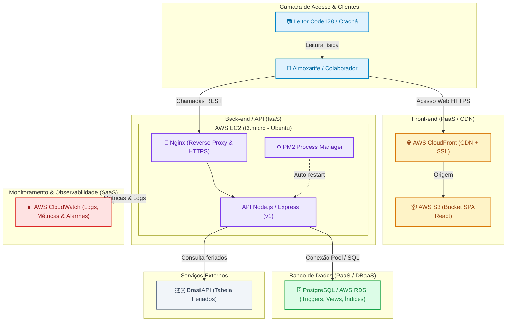

# Plano de Infraestrutura e Modelos de Serviço em Nuvem

**Responsável:** Guilherme Portilho da Rosa Santi ([@TGuiDev](https://github.com/TGuiDev))  
**Milestone:** M2 – Planejamento de Infraestrutura (Apresentação Dia Maker – 25/08)  
**Dependências:** Nenhuma  

---

## 1. Visão Geral e Modelos de Serviço

Tabela com a classificação de cada peça da solução do **Soufer Tools** no modelo de serviço de computação em nuvem (IaaS, PaaS, DBaaS, SaaS) e o racional da escolha:

| Peça da Solução | Serviço Escolhido | Modelo de Serviço | Justificativa Resumida |
|---|---|---|---|
| **Banco de Dados** | PostgreSQL (AWS RDS) | **PaaS / DBaaS** | Fornece PostgreSQL relacional padrão e gerenciado com integridade ACID estrita, backups automáticos, suporte a triggers, views e índices parciais, sem sobrecarga de manutenção do SO. |
| **Back-end / API** | AWS EC2 (t3.micro) | **IaaS** | Garante controle total sobre o ambiente de execução (Linux, Node.js 20, Nginx como reverse proxy e PM2), atendendo às regras de negócio com custo mínimo e previsibilidade. |
| **Front-end** | AWS S3 + AWS CloudFront | **PaaS / CDN** | Hospedagem de SPA estática com alta disponibilidade, entrega global de baixa latência e HTTPS nativo, eliminando a sobrecarga de gerenciar servidores web para arquivos estáticos. |
| **Monitoramento** | AWS CloudWatch | **SaaS** | Serviço pronto para coleta de métricas de hardware/sistema, agregação de logs do PM2/Nginx e alarmes automáticos em tempo real sem exigir infraestrutura própria de telemetria. |

---

## 2. Detalhamento e Justificativas das Escolhas

### 2.1 Banco de Dados: PostgreSQL / AWS RDS (PaaS / DBaaS)
* **Classificação:** *Platform as a Service* (PaaS) / *Database as a Service* (DBaaS).
* **Justificativa:** A adoção do PostgreSQL gerenciado (via AWS RDS ou instância relacional de banco dedicada) assegura um SGBD robusto, open-source e com total conformidade ACID. Essa abordagem elimina a necessidade de gerenciamento manual do sistema operacional, atualizações de segurança e backups, permitindo que a equipe aproveite todos os recursos nativos do SQL (DDL, triggers para transição de status de ferramentas, views consolidadas para KPIs e índices parciais de controle de empréstimos) sem dependência de serviços BaaS proprietários.

### 2.2 API / Back-end: AWS EC2 (IaaS)
* **Classificação:** *Infrastructure as a Service* (IaaS).
* **Justificativa:** O uso de uma instância EC2 (t3.micro) oferece controle direto e flexibilidade sobre o sistema operacional (Ubuntu Server), configuração fina do proxy reverso Nginx com SSL/TLS e gerenciamento de processos Node.js via PM2. Essa abordagem IaaS assegura autonomia para configurar portas, rotas de healthcheck e políticas de reinício automático, além de permitir testes fiéis ao ambiente de servidores corporativos.

### 2.3 Front-end: AWS S3 + CloudFront (PaaS / Hospedagem Estática)
* **Classificação:** *Platform as a Service* (PaaS) / *Storage & CDN as a Service*.
* **Justificativa:** O front-end React compilado é composto puramente por artefatos estáticos (HTML, JS, CSS, imagens). Armazená-los no S3 com distribuição via CDN CloudFront garante alta disponibilidade (99,99%), segurança através de certificados SSL gratuitos gerenciados pela AWS (ACM) e cache global com latência mínima para os almoxarifes e usuários finais, sem gastar ciclos de CPU do servidor de API.

### 2.4 Monitoramento e Observabilidade: AWS CloudWatch (SaaS)
* **Classificação:** *Software as a Service* (SaaS) / *Monitoring as a Service*.
* **Justificativa:** O CloudWatch opera como uma plataforma completa de observabilidade consumida como serviço, integrada nativamente aos recursos da AWS. Ele centraliza métricas de CPU/memória da EC2, armazena logs da aplicação e aciona alarmes automáticos em caso de falhas ou indisponibilidade da API sem requerer a manutenção de servidores dedicados a Prometheus, Grafana ou Elasticsearch.

---

## 3. Diagrama da Arquitetura em Nuvem

O fluxo de comunicação entre as peças e suas respectivas camadas de serviço:

---

## 4. Ambientes e Estratégia de Deploy

1. **Desenvolvimento Local:**
   - Front-end com Vite dev server ou outro (`localhost:5173`);
   - Back-end Node.js (`localhost:3000`);
   - Banco de dados PostgreSQL rodando localmente (via Docker ou serviço nativo).

2. **Ambiente de Produção (Nuvem):**
   - Front-end publicado no bucket AWS S3 e distribuído via CloudFront;
   - Back-end rodando na EC2 via PM2 (`pm2 startup` e `pm2 save`);
   - Banco de dados PostgreSQL gerenciado (AWS RDS) com credenciais e connection string configuradas via variáveis de ambiente (`.env`);
   - Healthcheck ativo na rota `/v1/health` monitorado por alarmes do CloudWatch.

3. **Plano de Contingência (Plano B):**
   - Caso haja impedimento na AWS ou necessidade de failover ágil, a API e o banco PostgreSQL poderão ser hospedados em plataformas PaaS alternativas (**Render** ou **Railway**) sem alteração no código-fonte ou modelagem SQL.
