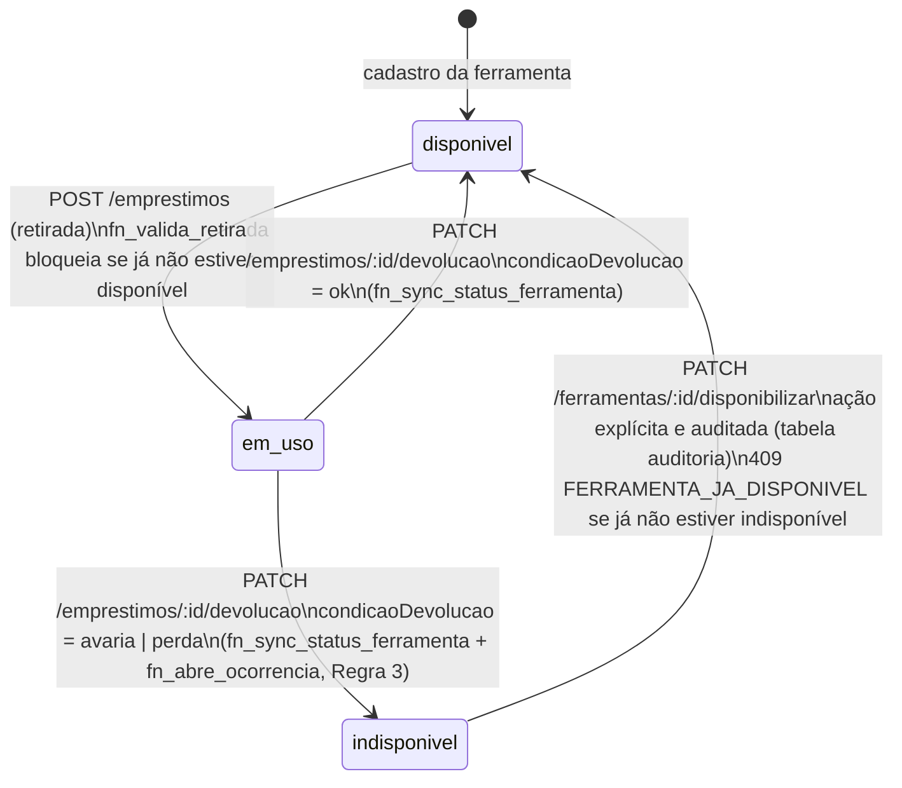

# Regras de negócio do SOUFER Tools

Este documento existe para a issue DATA-04 (#64): uma referência única,
pedida como evidência pelo prof. Max, explicando cada regra automática do
sistema — as 10 regras da Seção 3 do `CLAUDE.md` raiz. Para cada uma: onde
está implementada, o que acontece se for violada, e um exemplo real extraído
do código (migrations, validators, services) ou da suíte de testes.

As regras 1 a 9 são regras de **sistema** (têm implementação técnica). A
regra 10 é uma regra **institucional do curso**, tratada separadamente ao
final.

---

## Regra 1 — Um empréstimo aberto por ferramenta

**O que diz:** uma ferramenta não pode ter dois empréstimos abertos ao mesmo
tempo. Garantido pelo banco, não só pela API.

**Onde está implementada:**
- Índice único parcial `uq_emprestimo_aberto`
  (`api/db/migrations/0001_init.sql:209-211`):
  ```sql
  CREATE UNIQUE INDEX IF NOT EXISTS uq_emprestimo_aberto
  ON emprestimos (ferramenta_id, COALESCE(item_kit_id, 0))
  WHERE data_devolucao IS NULL;
  ```
- Reforçada pela trigger `fn_valida_retirada`
  (`api/db/migrations/0001_init.sql:348-371`), que bloqueia a retirada se a
  ferramenta (não-kit) não estiver com `status = 'disponivel'`.

**O que acontece se for violada:** a tentativa de `INSERT` que colidiria com
o índice único (ou a trigger) falha no banco com erro de restrição. A camada
de serviço (`api/src/services/emprestimoService.ts:60-67`) captura esse erro
do Postgres e traduz para **HTTP 409** com
`error.code = "FERRAMENTA_INDISPONIVEL"` (envelope de erro padrão da Seção 5
do `CLAUDE.md`).

**Exemplo real:** teste
`api/src/tests/emprestimoRoutes.test.ts:103` —
`'recusa ferramenta já emprestada com 409 FERRAMENTA_INDISPONIVEL'`: faz uma
retirada, repete o `POST /v1/emprestimos` para a mesma ferramenta e confirma
`res.status === 409` com o código acima. O caso de kit (peça avulsa vs. kit
inteiro) é coberto em `emprestimoRoutes.test.ts:245-255`.

---

## Regra 2 — Três estados da ferramenta, indisponível separado de em uso

**O que diz:** o status da ferramenta só pode ser `disponivel`, `em_uso` ou
`indisponivel`; indisponível é uma seção separada de "em uso" nas telas,
nunca aparecem juntas.

**Onde está implementada:**
- Enum `status_ferramenta` com exatamente esses três valores
  (`api/db/migrations/0001_init.sql:36-40`).
- View `vw_dashboard_kpis` já contabiliza os três separadamente
  (`api/db/migrations/0001_init.sql:554-561`).
- No front, páginas distintas (`web/src/pages/FerramentasPage.tsx` e
  `web/src/pages/IndisponiveisPage.tsx`), roteadas separadamente em
  `web/src/router.tsx`.

**O que acontece se for violada:** não é uma regra "violável" em tempo de
execução — é uma restrição de tipo. Qualquer valor fora dos três falha no
`INSERT`/`UPDATE` com erro de tipo do Postgres (`invalid input value for
enum status_ferramenta`), antes de qualquer lógica de negócio rodar.

**Exemplo real:** o seed (`api/db/seed.sql:149-170`) cadastra ferramentas só
como `'disponivel'`; os outros dois estados só aparecem através do fluxo real
de retirada (`em_uso`) e devolução com avaria/perda (`indisponivel`) — ver
Regra 3.

---

## Regra 3 — Avaria/perda na devolução abre ocorrência automaticamente

**O que diz:** se a devolução é registrada com avaria ou perda, uma
ocorrência é aberta automaticamente, herdando o colaborador responsável, e a
ferramenta vai para `indisponivel` com o motivo gravado.

**Onde está implementada:**
- Trigger `fn_abre_ocorrencia` (`api/db/migrations/0001_init.sql:472-508`),
  disparada depois do `UPDATE` em `emprestimos` que registra a devolução:
  insere em `ocorrencias` herdando `colaborador_id` do empréstimo quando
  `condicao_devolucao IN ('avaria', 'perda')`.
- Trigger irmã `fn_sync_status_ferramenta`
  (`api/db/migrations/0001_init.sql:436-469`), que muda
  `ferramentas.status` para `'indisponivel'` e grava `motivo_indisponivel`.

**O que acontece se for violada:** não é uma validação que recusa uma
requisição — é um efeito automático de trigger de banco, disparado em
qualquer `UPDATE` que leve a essa condição, inclusive fora da API. Não há
como contornar via corpo da requisição.

**Exemplo real:** `api/src/tests/emprestimoRoutes.test.ts:293` (avaria) e
`:309` (perda) — devolver com `condicaoDevolucao: 'avaria'` resulta em
`ferramentas.status = 'indisponivel'`, `motivo_indisponivel = 'avaria'`, e
uma linha nova em `ocorrencias` com o `colaborador_id` correto.

### Diagrama de estados da ferramenta (bônus "se sobrar tempo")

As Regras 1, 2 e 3 juntas definem a máquina de estados completa de
`ferramentas.status`. Toda transição é automática (trigger de banco) ou uma
ação explícita e auditada (nunca um `UPDATE` livre de status pelo corpo da
requisição — não há rota que aceite `status` diretamente, ver Regra 6 e a
issue API-14):



Observações sobre o diagrama:

- A transição `indisponivel → disponivel` **não é automática** — é a única
  ação explícita das quatro, de propósito (regra de negócio documentada em
  `api/src/services/ferramentaService.ts:243-246`: "após o reparo, a
  disponibilização deve ser uma ação explícita e auditável"). Tentar
  disponibilizar uma ferramenta que já está disponível devolve **409
  FERRAMENTA_JA_DISPONIVEL**.
- Ferramentas marcadas `eh_kit = true` têm uma variação: o status do kit
  inteiro só é sincronizado quando o registro de empréstimo/devolução é do
  kit inteiro (`item_kit_id IS NULL`); devolver uma peça avulsa com
  avaria/perda abre a ocorrência mas não muda o status do kit container (ver
  `docs/decisoes-pendentes.md`, seção "Devolução de peça avulsa de kit").

---

## Regra 4 — Atividade é campo opcional na retirada

**O que diz:** a atividade (para que a ferramenta vai ser usada) é opcional
na retirada.

**Onde está implementada:**
- `atividadeId` e `atividadeObservacao` são `.optional()` em
  `criarEmprestimoSchema` (`api/src/validators/emprestimoValidator.ts:50-51`).
- Coluna `emprestimos.atividade_id` é `NULLABLE`
  (`api/db/migrations/0001_init.sql:186`).

**O que acontece se for violada:** não há violação possível — é um campo
opcional, nunca gera erro por estar ausente.

**Exemplo real:** `api/src/tests/emprestimoRoutes.test.ts:115` —
`'aceita retirada sem atividade (Regra 4)'`: `POST /v1/emprestimos` sem
`atividadeId` retorna **201** com `atividade_id: null`.

---

## Regra 5 — Identificação do colaborador por matrícula, crachá ou nome

**O que diz:** a identificação aceita matrícula, código de crachá ou nome;
se não encontrar, abre cadastro rápido no meio do fluxo, sem perder o que já
foi preenchido.

**Onde está implementada:**
- `GET /v1/colaboradores/identificar` (`api/src/routes/v1/colaboradorRoutes.ts:131-137`)
  → `colaboradorService.identificar`: tenta matrícula exata primeiro, depois
  nome tolerante a acento/erro de digitação via `unaccent` + `pg_trgm`
  (índice `idx_colaboradores_nome_trgm`,
  `api/db/migrations/0003_colaboradores_identificacao.sql:29-30`).
- Cadastro rápido reaproveita o mesmo `POST /v1/colaboradores` já usado pela
  tela de cadastro, aberto a `manutencao`/`admin`.

**Divergência conhecida:** o schema não tem `codigo_cracha` como campo
separado — foi removido já no `0001_init.sql` porque, na prática, o crachá
**é** a própria matrícula (comentário explícito em
`api/src/validators/colaboradorValidator.ts:34-36`). A regra 5 ainda fala em
"código de crachá" como algo distinto da matrícula; o código trata os dois
como o mesmo valor.

**O que acontece se for violada (não encontrado):** retorna **404** — sinal
para o front abrir o cadastro rápido.

**Exemplo real:** `api/src/tests/colaboradorRoutes.test.ts:105` —
`'retorna 404 quando não encontra nenhum colaborador para o termo'`.

---

## Regra 6 — Responsável pelo registro vem sempre do JWT

**O que diz:** `usuario_retirada_id`, `usuario_devolucao_id`,
`registrada_por`, `criado_por` (e campos equivalentes como `resolvida_por`)
nunca são aceitos vindos do corpo da requisição — sempre do usuário logado.

**Onde está implementada:** comentários explícitos e código consistente em
todos os validators de escrita —
`api/src/validators/emprestimoValidator.ts:42-44,76-78`,
`api/src/validators/colaboradorValidator.ts:34-36`,
`api/src/validators/ocorrenciaValidator.ts:42-45`,
`api/src/validators/authValidator.ts:19-20`. Os controllers passam o ID do
usuário autenticado (`req.usuario!.id`) separadamente do `req.body` para o
service.

**O que acontece se for violada:** campos desconhecidos enviados no corpo
são **descartados silenciosamente pelo Zod** (comportamento padrão do
`z.object()`, sem `.passthrough()`/`.strict()` em nenhum schema de escrita)
— não há erro, o valor do JWT prevalece. Decisão registrada em
`docs/decisoes-pendentes.md` sobre não usar `.strip()` explícito por ser
redundante com esse comportamento.

**Exemplo real:** `api/src/tests/emprestimoRoutes.test.ts:124` —
`'ignora usuarioRetiradaId enviado no corpo (Regra 6)'`: envia
`{ usuarioRetiradaId: 999999, usuario_retirada_id: 999999 }`, recebe 201, e o
banco grava o ID do token, não `999999`. Cobertura equivalente em pelo menos
mais 6 rotas (colaboradores, devolução, ocorrências, auto-cadastro) — ver
issue API-14.

---

## Regra 7 — Código de patrimônio (⚠️ divergência entre o texto e o código real)

**O que o texto da regra diz:** código de patrimônio gerado a partir do ID
(`SF` + 6 dígitos), mesmo valor codificado no código de barras (Code128).
Marcada como **"em revisão"** no `CLAUDE.md` desde a visita técnica à Soufer
(issue DB-01).

**O que o código realmente faz hoje:** gera um `codigo_identificacao`
**SMALLINT de 4 dígitos (1 a 9999)**, sem prefixo `SF` e sem relação com o
`id` da linha:
- Coluna com `CHECK` (`api/db/migrations/0001_init.sql:144`):
  `codigo_identificacao SMALLINT CHECK (codigo_identificacao BETWEEN 1 AND 9999)`.
- Trigger `fn_gera_codigo_identificacao`
  (`api/db/migrations/0001_init.sql:273-300`): busca o menor código livre
  entre 1 e 9999, serializado com `pg_advisory_xact_lock` para evitar corrida
  entre cadastros concorrentes (ver `docs/issues/api-13-endpoints-ocorrencias.md`
  para o histórico dessa correção).
- Unicidade só entre ferramentas ativas, via índice parcial
  `uq_ferramenta_codigo_ativo` (`api/db/migrations/0001_init.sql:163-165`) —
  o código é reaproveitável quando a ferramenta é baixada (`ativo = false`).
- Não existe, em nenhum lugar do código (`api/src/`), geração ou validação de
  um formato `SF######` — a busca por `"SF"`/`codigo_patrimonio` não retorna
  nada.

**Por que a divergência não foi corrigida nesta issue:** o próprio
`CLAUDE.md` já marca a Regra 7 como pendente de decisão em ata (scanner vs.
gravação a lápis elétrico, etiqueta 50x25mm que não sobrevive à manutenção).
Documentar aqui o comportamento real, com esta nota explícita, em vez de
reescrever a regra por conta própria.

**O que acontece se for violada:** inserir um valor fora de 1-9999 falha no
`CHECK` do banco. Esgotar os 9999 códigos ativos dispara
`RAISE EXCEPTION 'Limite máximo de 9999 ferramentas ativas atingido...'`
(`api/db/migrations/0001_init.sql:287`).

**Exemplo real:** `api/src/tests/ferramentaService.test.ts:38-45` cadastra
uma ferramenta sem informar `codigo_identificacao` e confirma que a trigger
gera o valor automaticamente. A geração concorrente (dois cadastros
simultâneos disputando o mesmo código) foi corrigida na migration
`0005_corrige_concorrencia_codigo_identificacao.sql` (serializa com
`pg_advisory_xact_lock`) e validada por um teste de estresse manual (15/30
inserções concorrentes) descrito em
`docs/issues/api-13-endpoints-ocorrencias.md` — não há, hoje, um teste
automatizado permanente para essa concorrência na suíte principal.

---

## Regra 8 — Três perfis e suas permissões

**O que diz (atualizado em 30/09/2026):** `manutencao` opera o balcão
(retirada, devolução, consulta, indisponíveis, calendário, histórico, e faz
cadastro rápido de colaborador); `admin` aprova auto-cadastros e cuida dos
cadastros auxiliares (Colaboradores, Ferramentas, Categorias, Setores —
edição/inativação exclusivas do admin, leitura/criação de
ferramenta/colaborador abertas à manutenção) e, desde esta issue, também lê
e cadastra Atividades; `consulta` tem sessão de 15 minutos só leitura.

**Onde está implementada** (confirmado rota a rota, `authorize(...)` em cada
arquivo de `api/src/routes/v1/`):

| Recurso | GET | POST | PUT/PATCH | DELETE |
|---|---|---|---|---|
| Ferramentas | `manutencao`,`admin` | `manutencao`,`admin` | `admin` | `admin` |
| Colaboradores | `manutencao`,`admin` | `manutencao`,`admin` | `admin` | `admin` |
| Setores / Categorias | `manutencao`,`admin` | `admin` | `admin` | `admin` |
| **Atividades** | `manutencao`,`admin` (corrigido nesta issue) | `manutencao`,`admin` (corrigido nesta issue) | `manutencao` | `manutencao` |
| Balcão (identificar, por-código, etiqueta, disponibilizar, empréstimos, ocorrências) | `manutencao` | `manutencao` | `manutencao` | — |
| `usuarios` (aprovação) | `admin` | — | `admin` | — |

O 403 genérico vem de `api/src/middlewares/authorize.ts:4-22`
(`error.code = "ACCESS_DENIED"`).

**Divergência encontrada e corrigida durante esta issue:** o texto da Regra
8 (versão de 30/09/2026) já dizia que o admin "lê e cadastra" atividades, mas
`api/src/routes/v1/atividadeRoutes.ts` autorizava só `manutencao` em **todas**
as rotas — um `admin` recebia 403 até para listar atividades. Corrigido
adicionando `admin` ao `authorize(...)` de `GET`/`POST` (lista, por ID e
criação); `PUT`/`PATCH`/`DELETE` continuam exclusivos de `manutencao`, que
mantém acesso completo por consumir o campo de atividade na retirada — o
texto da regra não menciona o admin editando ou inativando atividades.

**O que acontece se for violada:** **HTTP 403** com `error.code =
"ACCESS_DENIED"` e `details: [{ requiredRoles, userRole }]`.

**Exemplo real:**
- `api/src/tests/permissoesCadastros.test.ts` — manutenção lê mas recebe 403
  em escrita de setores/categorias; admin recebe 403 em rotas de balcão
  (`identificar`, `por-codigo`, `/emprestimos`); e, após a correção desta
  issue, admin lê/cadastra atividades mas recebe 403 ao editar/inativar.
- `api/src/tests/ferramentaPermissoes.test.ts:13-37` — par simétrico em
  ferramentas.

---

## Regra 9 — Feriados da BrasilAPI com cache e fallback

**O que diz:** feriados vêm da BrasilAPI, com cache em tabela própria e
fallback de sábado/domingo se a API estiver fora.

**Onde está implementada** (`api/src/services/feriadoService.ts`):
- `buscarNaBrasilApi` (linhas 25-48): chama
  `https://brasilapi.com.br/api/feriados/v1/{ano}`; falha de rede ou status
  não-OK lança `AppError(502, 'BRASIL_API_UNAVAILABLE')`.
- Cache: tabela `feriados` (`api/db/migrations/0001_init.sql:246-253`),
  preenchida por `sincronizarFeriados` (upsert).
- `gerarFallbackFinsDeSemana` (linhas 83-101): gera só sábados/domingos do
  ano, marcados com `tipo: 'fallback_fim_de_semana'`.
- `listarPorAno` (linhas 108-133): prioriza o cache; se vazio, tenta
  sincronizar; se a BrasilAPI falhar (`BRASIL_API_UNAVAILABLE`), cai no
  fallback e retorna `fonte: 'fallback_fim_de_semana'` em vez de propagar o
  erro ao cliente.

**O que acontece se for violada (fonte externa indisponível):** não é
tratado como erro para quem chama a API — é um fallback silencioso
(`console.warn`, linha 126-128); o cliente recebe 200 com
`fonte: 'fallback_fim_de_semana'` em vez de um 502.

**Exemplo real:** `api/src/tests/feriado.test.ts:130` —
`'GET /v1/feriados?ano=2026 retorna lista de feriados do cache/banco'` cobre
o caminho de cache. **Lacuna encontrada:** não há, hoje, um teste automatizado
que force a falha da BrasilAPI (mock de rede) para exercitar o caminho de
fallback — ele existe e está implementado (linhas 83-101, 125-129), mas sem
cobertura de teste direta. Fica registrado aqui como item para uma issue de
testes futura, fora do escopo desta documentação.

---

## Regra 10 — Entrega fora do prazo ou impressa = nota zero

**Sem implementação técnica — é uma regra institucional do curso, não do
software.** É um critério de avaliação do Projeto Integrador sobre o
processo de entrega do trabalho acadêmico (prazo no Classroom, formato
digital), não uma regra de negócio do sistema SOUFER Tools. Não há, e não
deveria haver, trigger, validação ou endpoint associado a ela — nenhuma
busca no código por "nota zero", "prazo de entrega" ou afins retorna
qualquer rotina relacionada (a única menção a "impressão" no código é
`etiqueta_impressa_em` em `ferramentas`, a etiqueta de código de barras da
ferramenta, sem relação com a entrega do trabalho).

---

## Resumo

| # | Regra | Implementação técnica | Status |
|---|---|---|---|
| 1 | Empréstimo único por ferramenta | Índice único + trigger | ✅ Implementada e testada |
| 2 | 3 estados da ferramenta | Enum + páginas separadas | ✅ Implementada |
| 3 | Avaria/perda abre ocorrência | 2 triggers encadeadas | ✅ Implementada e testada |
| 4 | Atividade opcional | Schema Zod | ✅ Implementada e testada |
| 5 | Identificação por matrícula/nome | Service + índice trgm | ✅ Implementada e testada (divergência do "crachá" documentada) |
| 6 | Autoria sempre do JWT | Validators + controllers | ✅ Implementada e testada em 7+ rotas |
| 7 | Código de patrimônio | Trigger + CHECK | ⚠️ Implementada, mas diverge do texto formal (4 dígitos, não `SF`+6) |
| 8 | 3 perfis e permissões | `authorize()` por rota | ✅ Implementada; 1 divergência encontrada e corrigida nesta issue (atividades) |
| 9 | Feriados BrasilAPI + fallback | Service com cache | ✅ Implementada; fallback sem teste automatizado dedicado |
| 10 | Entrega fora do prazo = zero | — | N/A — regra institucional, sem implementação de software |
